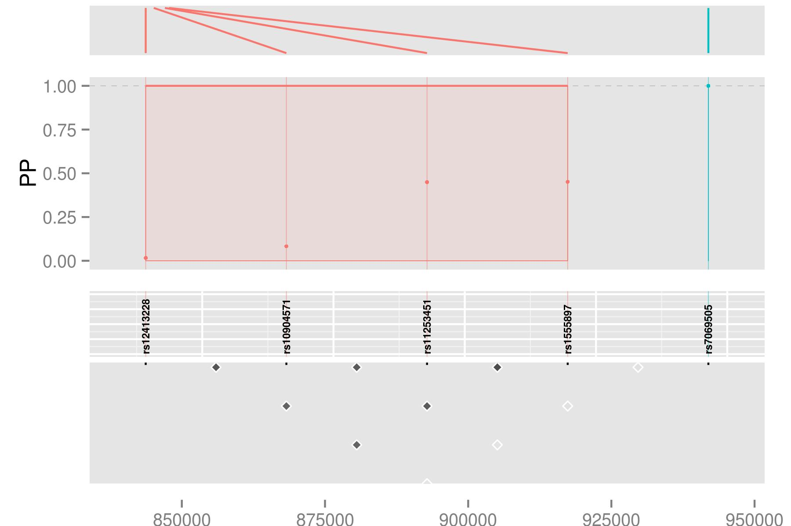

<h1>GUESSFM Plotting</h1>
<font color="grey">
*Chris Wallace // [web](http://www-gene.cimr.cam.ac.uk/staff/wallace) // [email](mailto:chris.wallace at cimr.cam.ac.uk)*  
</font>

<div id="table-of-contents">
<h2>Table of Contents</h2>
<div id="text-table-of-contents">
<ul>
<li><a href="#orgheadline1">1. Some example data</a></li>
<li><a href="#orgheadline2">2. Prior/posterior number of SNPs in the model</a></li>
<li><a href="#orgheadline3">3. SNP groups</a></li>
<li><a href="#orgheadline4">4. Patterns of SNPs selected</a></li>
</ul>
</div>
</div>

# Some example data

Let's start with the data from the main vignette (GUESSFM Introduction):

```{r }
library(GUESSFM)
mydir <-  system.file("extdata",package="GUESSFM")
(load(file.path(mydir,"simdata.RData")))
```

# Prior/posterior number of SNPs in the model

The prior for each model is dependent only on the number of SNPs it contains.  It is a beta-binomial model, and you need specify only the mean and overdispersion (variance relative to binomial) of this distrubtion.

```{r }
n<-100 # 100 SNPs in region
  x <- 1:10 # consider prior for up to 10 causal SNPs
  xbar <- 3 # expect around 3 causal

  ## a binomial prior
  y <- snpprior(x, n, xbar)
  plot(x, y, type="h")

  ## is equivalent to
  y1.0 <- snpprior(x, n, xbar, overdispersion=1.0)
  points(x, y1.0, col="red")

  ##larger values of overdispersion change the distribution:
  y1.1 <- snpprior(x, n, xbar, overdispersion=1.1)
  y1.5 <- snpprior(x, n, xbar, overdispersion=1.5)
  y2.0 <- snpprior(x, n, xbar, overdispersion=2.0)
  points(x, y1.1, col="orange")
  points(x, y1.5, col="pink")
  points(x, y2.0, col="green")
```

`pp.nsnp` calculates a posterior distribution for the number of causal SNPs in the region, and with an argument `plot=TRUE` will also plot the distribution.  If you supply the prior expected number of causal SNPs, you can compare the posterior to the prior.

```{r }
pp.nsnp(d,plot=TRUE)
pp <- pp.nsnp(d,plot=TRUE,expected=3)
```

So that's quite nice.  We had a vague-ish prior, spreading the prior weight across 0-7 SNP models, with an expected number of causal variants set at 3.  We simulated data with two causal variants, and the posterior is peaked on 2 SNPs, with some weight on 3-4 SNPs.

The second time, we stored an underlying `pp.nsnp` object in `pp`.  We can check a couple of quality control measures on this.  Our priors are left skewed and unimodal, and so should our posteriors be:

```{r }
qc(pp)
```

# SNP groups

In the introduction vignette, we formed a `snppicker` object, `sp`.  We can extract the SNP groups from this and use it to generate a useful summary object

```{r }
groups <- as(sp,"groups")
groups

library(snpStats)
data(for.exercise, package="snpStats") # for SNP information
summx <- guess.summ(sm,groups=groups,snps=snp.support,position="position")
summx <- scalepos(summx,position="position")

library(ggplot2)
signals <- signal.plot(summx)
signals
snps <- ggsnp(summx)
snps
lds <- ggld(X, summx)
lds
chr <- ggchr(summx)
chr
```

Individually, perhaps only the signals plot is useful, which shows us two groups of SNPs which together have joint gMPPI close to 1.  The red one contains four SNPs, and the blue group 1.  The other tracks are useful to put this into some context.   `snps` labels the SNPs, `lds` plots the r<sup>2</sup> between pairs of SNPs.  Grouped SNPs are ordered so SNPs in the same group are together, but this is unlikley to reflect chromosome position.  `chr` is a plot of linking the group position to the chromosome position. 

If you have `ggbio` installed, then this function will line up the above plots

    library(ggbio)
    tracks(chr,signals,snps,lds,heights=c(1,3,1,2))



This sort of thing can be useful if you have other tracks (eg, functional information) you want to line up.

# Patterns of SNPs selected

It can be helpful to see which groups of SNPs are selected together in
models, or never together.  If groups of SNPs are never selected
together, then they maybe alternative explanations for the phenotype
but do not jointly explain for of the variance than either set alone.
Sometimes, this means `snp.picker` has failed to group SNPs properly,
and these groups should be combined.  You can inspect whether this
might be helpful using `check.merge()` and use `groups.merge()` to do
the merge.

```{r }
pattern.plot(SM=sm,groups=groups)
```
